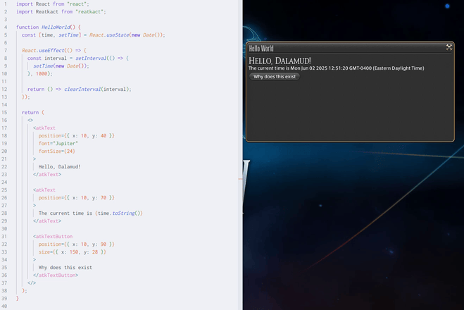

# Reatkact

A React renderer for FINAL FANTASY XIV.



## How?

FINAL FANTASY XIV uses an in-house UI architecture known as ATK, composed of addons (in-game windows) and nodes (the elements in the windows). While [we've known about the UI system for years](https://github.com/aers/FFXIVClientStructs/commit/0ec02e7ff0cbd9ebec7f46548fa34c846fa585cd), there wasn't an easily accessible way to create custom UI from plugins.

Recently, support for creating custom addons was added to [KamiToolKit](https://github.com/MidoriKami/KamiToolKit), opening the door to creating custom UI. KTK wraps addons and nodes in idiomatic C# classes, making it easy to create and manipulate addons at runtime. Using [the Node API for .NET](https://microsoft.github.io/node-api-dotnet/), a real Node.js instance can be ran in the game process, and [react-reconciler](https://github.com/facebook/react/tree/main/packages/react-reconciler) is used to create a custom React renderer.

The .gif above includes [this sample code](https://github.com/NotNite/Reatkact/blob/main/js/hello-world/src/index.tsx). While there are only a few elements/props implemented right now, more elements can be easily added to the JS bridge (or KTK itself). Almost every feature of React works perfectly, thanks to react-reconciler.

This plugin itself is kind of low-effort, and it mainly just plugs existing libraries together. This was made possible from the efforts of people like [Kami](https://github.com/MidoriKami), [Hasel](https://github.com/haselnussbomber), [aers](https://github.com/aers), and everyone working on [FFXIVClientStructs](https://github.com/aers/FFXIVClientStructs). Thank you!

## Why?

[Dalamud](https://github.com/goatcorp/Dalamud) uses [ImGui](https://github.com/ocornut/imgui) for plugin UI, which can be hard to work with for complex plugin UI. While [helper](https://github.com/goatcorp/Dalamud/tree/master/Dalamud/Interface/Utility/Raii) [libraries](https://github.com/Ottermandias/OtterGui/) exist, some plugin developers hate using ImGui, and it's been a long standing joke-bikeshed combo that plugins should use another UI library. Many people have joked about ([and](https://github.com/Styr1x/Browsingway) [made](https://github.com/avafloww/Grebuloff)) CEF integration.

Using a custom React renderer removes the overhead of running an entire web browser, while still keeping the flexibility React offers for building plugin UI. This is how [React Native](https://reactnative.dev/) works - use JavaScript for creating UI, render the UI somewhere with native code. Also, using ATK for rendering means it integrates well with the game's UI!

**However, this is (of course) mostly for demonstration/shitpost points, please don't actually use this in your plugin.** None of this is designed to be used as a library, anyways.

## Development notes

### Implemented features

Currently, the only implemented components are `atkText` and `atkTextButton`, with a subset of props implemented for them. Most things beyond position/size are not implemented. Events are not implemented yet, as they need a custom callback system.

SeString macros work in text, but they need to be escaped as a string because of the used characters (e.g. `{"<color(0xFFFFFF)>Red text!<color(stackcolor)>"}`), and they aren't fully evaluated. This might be converted into a separate component in the future.

There is no automatic layouting, as ATK doesn't really have that. Components must set the X/Y coordinates manually, like the game itself does.

### TODO

- [ ] Implement more elements
- [ ] Add event handlers (e.g. button clicks)
- [ ] Add full SeString evaluation (only some macro strings are supported right now)
- [ ] Send Node.js logs to the plugin
- [ ] Add (hot) loading custom scripts
- [x] Expose properties directly on the classes instead of calling a props method

### Node.js runtime

The Microsoft Node.js libraries currently use a fork of Node.js 20. This runtime can only be started once per process, so the existing pointer is saved in the plugin config (if there's a better way to persist this let me know). The game may crash or deadlock if things aren't properly unloaded and GC'd, so be careful!

### Building JS code

This must be built before the plugin itself. [pnpm](https://pnpm.io/) 10 is required.

```shell
cd js
pnpm i -r
pnpm run build # or `pnpm run watch`, `pnpm run clean`
```

### Creating a new element

- Create the node's bridge class (see the classes in `Bridge/Nodes`).
- Register the bridge class in the Node runtime (`NodeRuntime.cs`).
- Define the bridge class in the TypeScript types (`types/bridge.ts`).
- Define the props in the TypeScript types (`types/config.ts`).
- Map the React props to the bridge class (`bridge.ts`).
